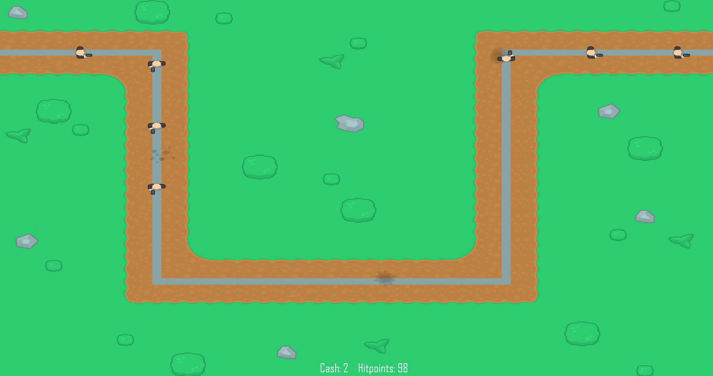
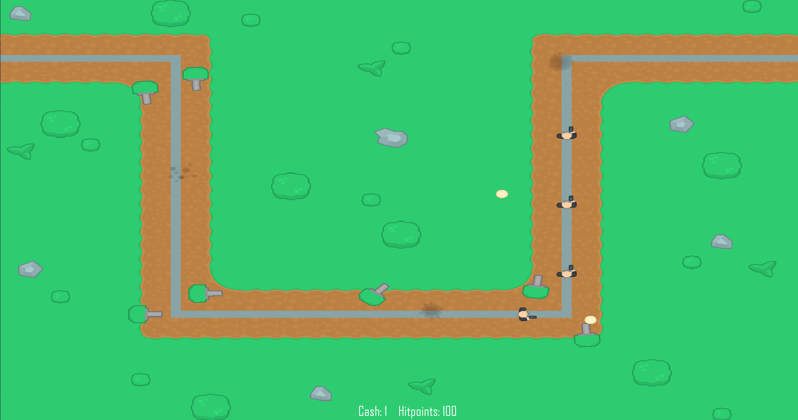
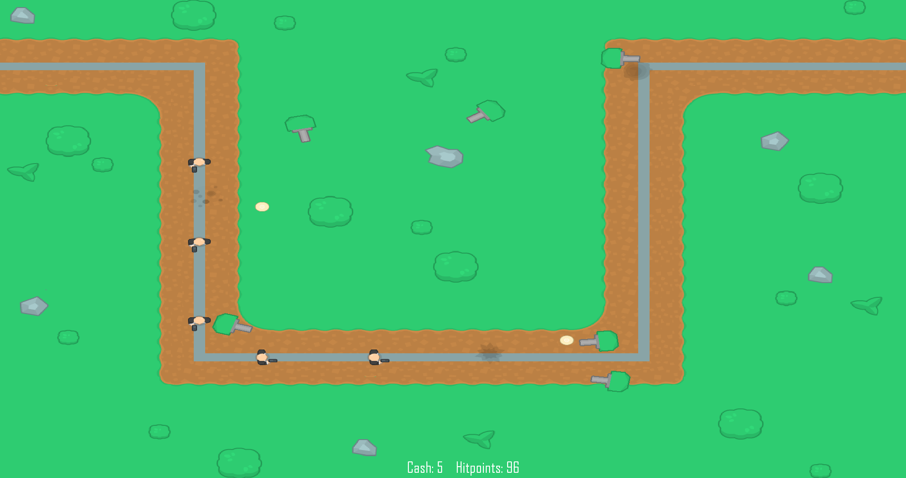
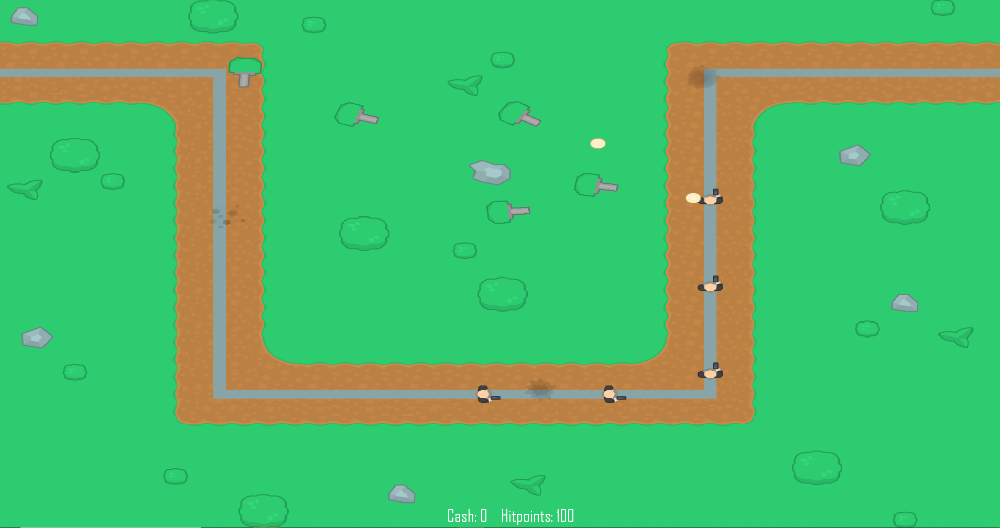

# Tower Defence
A basic tower defence game written in Java using the LibGDX framework.

## Goal
The goal of this project was to write a basic framework for the Java LibGDX framework. It includes features such as rendering, game events, camera controlling and projectiles. The tower defence game was created to drive the force of the framework development in a fun way.

## Images

